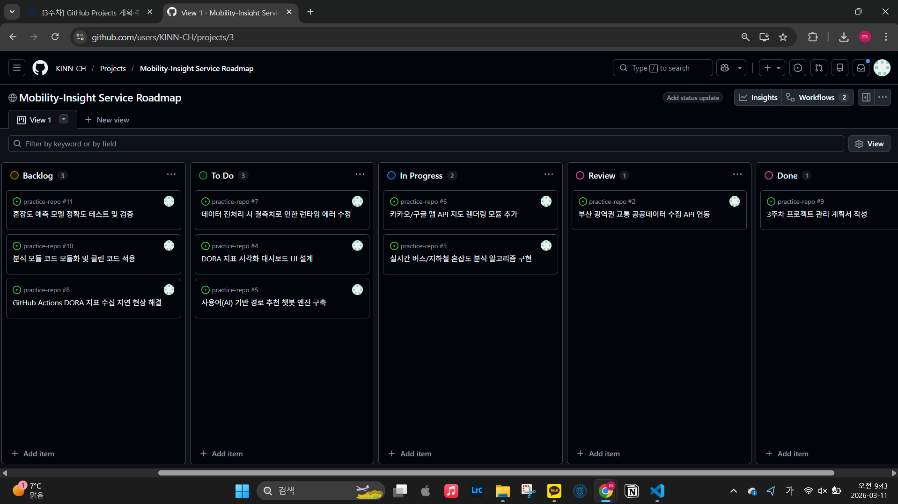

# [Week 3] Project Management & Backlog Construction

## 1. 개요 (Overview)
본 단계에서는 **Mobility-Insight AI** 프로젝트의 효율적인 개발 및 운영을 위해 GitHub Projects를 활용한 칸반(Kanban) 기반의 애자일(Agile) 관리 체계를 구축하였습니다. 10개 이상의 백로그를 수립하고, 라벨 및 마일스톤 시스템을 통해 개발 우선순위를 정의합니다.

---

## 2. 프로젝트 칸반 보드 (Kanban Board)
교수님 가이드라인에 따라 5개 상태 컬럼(Backlog, To Do, In Progress, Review, Done)을 설정하고 이슈를 배치하였습니다.

- **Backlog**: 프로젝트 전체 아이디어 및 장기 작업
- **To Do**: 이번 스프린트(Milestone 1) 내 착수 예정 작업
- **In Progress**: 현재 개발 진행 중인 핵심 모듈 (API 연동 및 알고리즘)
- **Review**: 개발 완료 후 검증 및 코드 리뷰 단계
- **Done**: 완료된 기획 및 관리 작업

---

## 3. 이슈 및 라벨링 체계 (Issues & Labels)
총 10개의 이슈를 생성하였으며, 각 이슈의 성격에 맞는 라벨을 부여하여 가독성을 높였습니다.

| 라벨명 | 의미 | 비고 |
| :--- | :--- | :--- |
| `type:feature` | 신규 기능 개발 | API 연동, UI 설계 등 |
| `type:bug` | 수정이 필요한 오류 | 결측치 처리, 통신 오류 등 |
| `priority:high` | 높은 우선순위 | 즉시 해결이 필요한 핵심 작업 |
| `documentation` | 문서화 작업 | README 및 결과 보고서 |
| `refactor` | 코드 구조 개선 | 모듈화 및 클린 코드 적용 |

---

## 4. 마일스톤 계획 (Milestones)
전체 개발 일정을 2개의 주요 마일스톤(Sprint)으로 구분하여 관리합니다.

1. **Sprint 1: Core Analysis Module**
   - 목표: 공공데이터 연동 및 기초 분석 알고리즘 구축
   - 상태: **진행 중 (In Progress)**
2. **Sprint 2: Visualization & AI Optimization**
   - 목표: 대시보드 시각화 및 AI 모델 고도화
   - 상태: **대기 (Planned)**

---

## 5. (선택과제) 프로젝트 분석 시안
GitHub Project의 **Insights** 기능을 활용하여 향후 아래 지표를 모니터링할 예정입니다.
- **Velocity**: 스프린트별 이슈 처리 속도 측정
- **Cycle Time**: 이슈 생성부터 완료(Done)까지의 소요 시간 분석
- **Burndown Chart**: 마감일 기준 남은 작업량 추적

## 6. DORA Metrics (자동 업데이트)
> GitHub Actions를 통해 매 배포 시 실시간 지표가 자동으로 업데이트됩니다.

<!-- START_DORA_METRICS -->
| 지표 (Metric) | 수치 (Value) |
| :--- | :--- |
| Deployment Frequency | Daily |
| Lead Time for Changes | 1.5 days |
| Change Failure Rate | 2% |
| Time to Restore Service | 1 hour |
<!-- END_DORA_METRICS -->