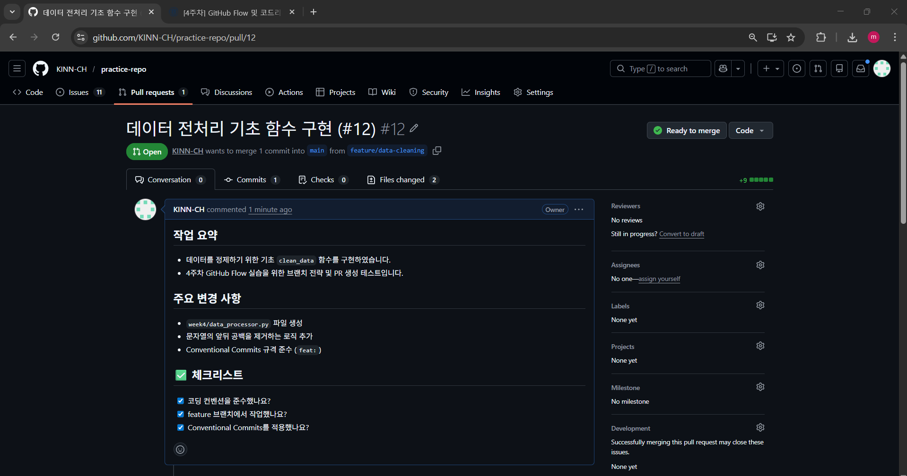
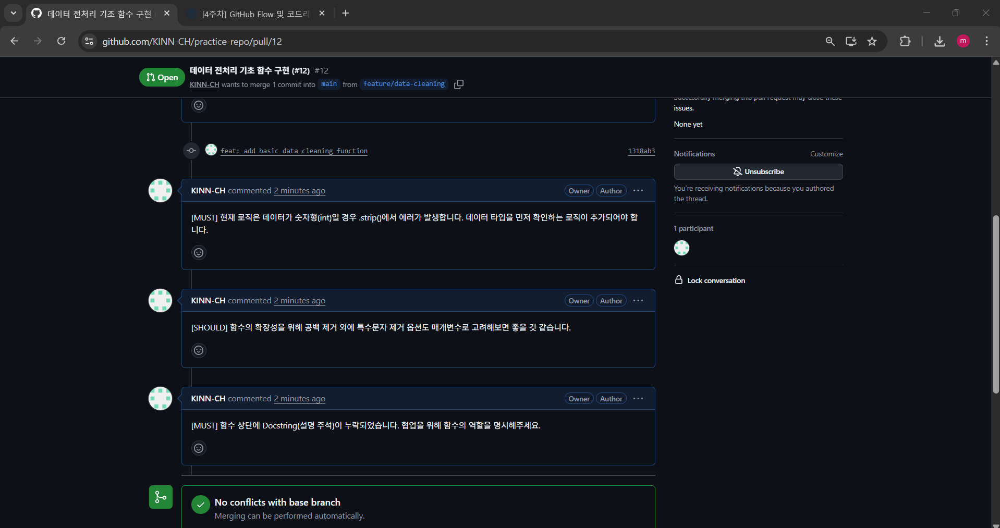
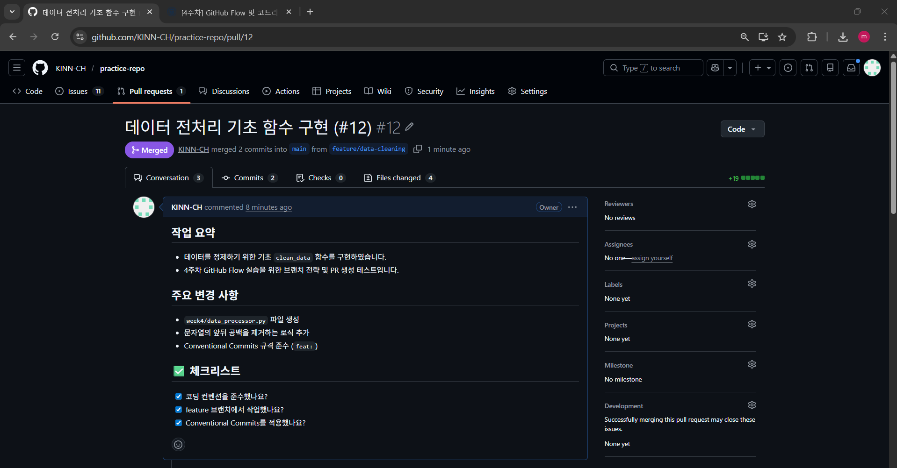

# [Week 4] GitHub Flow & Code Review Practice

## 1. 개요 (Overview)
본 단계에서는 팀 협업의 핵심인 **GitHub Flow** 전략을 실습하였습니다. `feature` 브랜치를 활용한 기능 개발, **Conventional Commits** 준수, 그리고 **[MUST]/[SHOULD]** 태그를 활용한 코드 리뷰 프로세스를 통해 협업 역량을 강화하였습니다.

---

## 2. GitHub Flow 실습 과정

### ① 브랜치 전략 (Branching Strategy)
- **Main Branch**: 배포 가능한 상태의 안정된 코드 유지
- **Feature Branch**: 기능을 개발하기 위한 독립적인 가지 (`feature/data-cleaning`)
- **PR & Merge**: 개발 완료 후 코드 리뷰를 거쳐 `main`으로 병합

### ② Pull Request & Code Review
교수님 가이드라인에 따라 1인 2역으로 구조화된 피드백을 주고받았습니다.

*▲ PR 생성 및 본문 템플릿 적용 화면*

*▲ [MUST] / [SHOULD] 태그를 활용한 상세 코드 리뷰 내역*

### ③ 리뷰 반영 및 머지 (Address Feedback)
- 지적된 [MUST] 사항(예외 처리 및 Docstring 추가)을 수정하여 추가 커밋 푸시
- 모든 리뷰 해결(Resolve) 후 `main` 브랜치로 최종 병합(Merged) 완료

---

## 3. 협업 자동화 설정 (선택과제)
- **PR Template**: `.github/PULL_REQUEST_TEMPLATE.md`를 작성하여 PR 작성 규격 통일
- **Branch Protection**: `main` 브랜치 보호 규칙 설정을 통해 PR 및 승인 없는 직접 푸시 방지 (설정 완료)

---

## 4. DORA Metrics (실시간 업데이트)
> GitHub Actions를 통해 매 배포 시 지표가 자동으로 업데이트됩니다.

<!-- START_DORA_METRICS -->
| 지표 (Metric) | 수치 (Value) |
| :--- | :--- |
| Deployment Frequency | Daily |
| Lead Time for Changes | 1.5 days |
| Change Failure Rate | 2% |
| Time to Restore Service | 1 hour |
<!-- END_DORA_METRICS -->

---

## 5. 학습 결과 및 회고
- **Conventional Commits**를 통해 커밋 메시지만으로 변경 사항을 명확히 파악할 수 있었습니다.
- **[MUST]/[SHOULD]** 리뷰 방식을 통해 감정적인 소모 없이 건설적인 코드 품질 개선이 가능함을 체험했습니다.